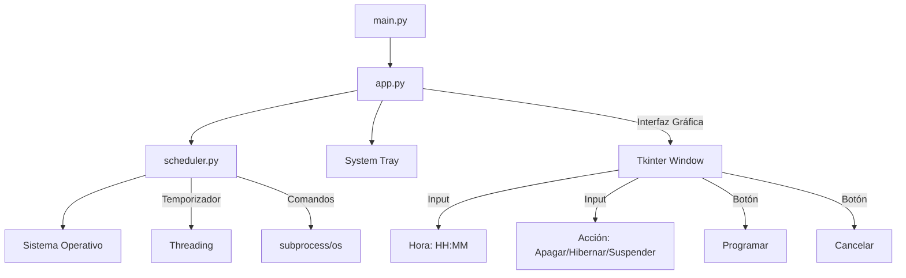
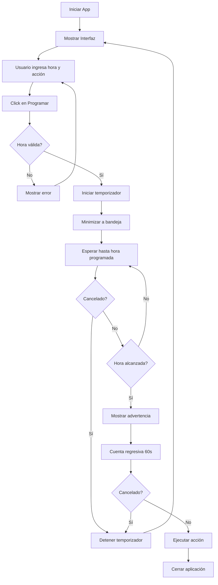

# Plan de Desarrollo: PowerOff-Timer

## 📋 Requisitos Funcionales

### Funcionalidades Principales
- ✅ Programar apagado del sistema a una hora específica (formato 24h: HH:MM)
- ✅ Opciones de acción: Apagar, Hibernar, Suspender
- ✅ Botón de cancelación para detener la acción programada
- ✅ Notificación/advertencia antes de ejecutar la acción
- ✅ Minimizar a la bandeja del sistema (system tray)
- ✅ Ejecutar en segundo plano

## 🏗️ Arquitectura de la Aplicación

### Estructura de Archivos
```
PowerOff-Timer/
├── main.py          # Punto de entrada de la aplicación
├── app.py           # Interfaz gráfica con Tkinter
├── scheduler.py     # Lógica de programación y ejecución
└── README.md        # Documentación de uso
```

### Diagrama de Componentes



### Diagrama de Flujo de Ejecución



## 🔧 Detalles Técnicos por Módulo

### 1. main.py
**Responsabilidad:** Punto de entrada de la aplicación

**Funciones:**
- Inicializar la aplicación
- Crear instancia de la interfaz gráfica
- Manejar excepciones globales

### 2. app.py
**Responsabilidad:** Interfaz gráfica y gestión de eventos

**Componentes UI:**
- Campo de entrada para hora (HH:MM)
- Selector de acción (Combobox: Apagar/Hibernar/Suspender)
- Botón "Programar"
- Botón "Cancelar"
- Label de estado
- Icono en bandeja del sistema

**Funcionalidades:**
- Validar formato de hora
- Comunicarse con scheduler.py
- Minimizar/restaurar desde bandeja
- Mostrar ventana de advertencia
- Actualizar estado en tiempo real

### 3. scheduler.py
**Responsabilidad:** Lógica de programación y ejecución de comandos

**Funciones principales:**
- `schedule_action(target_time, action_type)`: Programar acción
- `cancel_scheduled_action()`: Cancelar acción programada
- `execute_action(action_type)`: Ejecutar comando del sistema
- `show_warning()`: Mostrar advertencia 60 segundos antes
- `calculate_wait_time(target_time)`: Calcular tiempo de espera

**Comandos del Sistema (Windows):**
- Apagar: `shutdown /s /t 0`
- Hibernar: `shutdown /h`
- Suspender: `rundll32.exe powrprof.dll,SetSuspendState 0,1,0`

**Threading:**
- Usar `threading.Thread` para no bloquear la UI
- Usar `threading.Event` para cancelación

## 📦 Dependencias

### Librerías Estándar de Python
- `tkinter` - Interfaz gráfica
- `threading` - Ejecución en segundo plano
- `subprocess` - Ejecutar comandos del sistema
- `datetime` - Manejo de fechas y horas
- `os` - Operaciones del sistema

### Librerías Externas (opcional)
- `pystray` - Para icono en bandeja del sistema (si no se usa tkinter nativo)
- `Pillow` - Para crear iconos personalizados

## 🎨 Diseño de la Interfaz

### Ventana Principal
```
┌─────────────────────────────────────┐
│  PowerOff-Timer                  [_][□][X]│
├─────────────────────────────────────┤
│                                     │
│  Programar apagado del sistema      │
│                                     │
│  Hora: [__:__] (HH:MM)             │
│                                     │
│  Acción: [Apagar ▼]                │
│                                     │
│  [  Programar  ] [  Cancelar  ]    │
│                                     │
│  Estado: Esperando...               │
│                                     │
└─────────────────────────────────────┘
```

### Ventana de Advertencia
```
┌─────────────────────────────────────┐
│  ⚠️ Advertencia                      │
├─────────────────────────────────────┤
│                                     │
│  El sistema se apagará en:          │
│                                     │
│         60 segundos                 │
│                                     │
│  [     Cancelar Apagado     ]      │
│                                     │
└─────────────────────────────────────┘
```

## ✅ Criterios de Aceptación

1. ✅ La aplicación debe iniciar sin errores
2. ✅ Debe validar el formato de hora (HH:MM)
3. ✅ Debe permitir seleccionar entre Apagar/Hibernar/Suspender
4. ✅ Debe minimizarse a la bandeja del sistema
5. ✅ Debe mostrar advertencia 60 segundos antes de la acción
6. ✅ El botón cancelar debe detener la acción programada
7. ✅ Debe ejecutar correctamente los comandos del sistema
8. ✅ La interfaz debe ser clara y fácil de usar

## 🚀 Próximos Pasos

1. Mejorar la UX/UI

---
